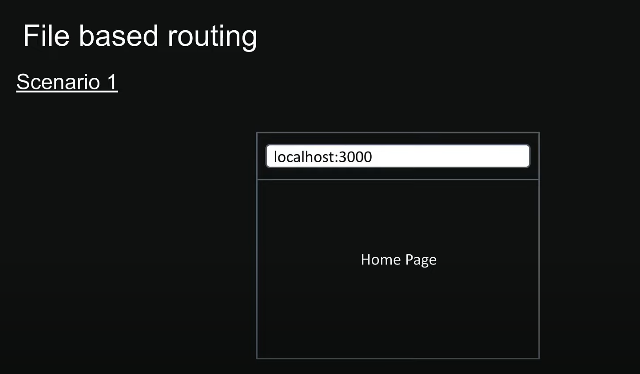
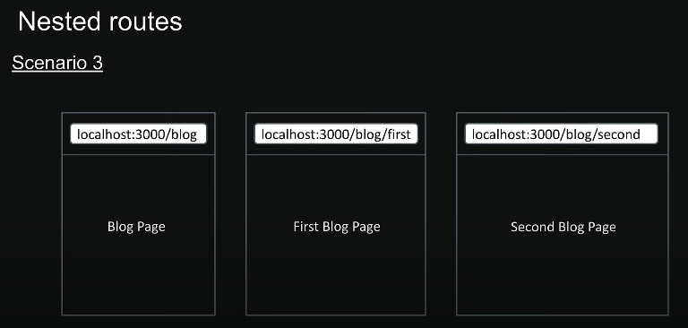

# Routing Concept :-
- Next.js provide us inbuilt routing system. If you have to create different webpages such as :- about,profile,home etc than we have to create a folder name `app` and inside this folder just create the different folder having name home,about,profile etc and the route automatically gets created.

### Example of Simple Routing :-

```
-> app
    -> home
        - page.tsx
    -> about
        - page.tsx
    -> profile
        - page.tsx
    - layout.tsx
    - page.tsx
```


### Example of Nested Routing :-
---

---
- If we have to create routes like :- http://localhost:3000/blog/blogone , http://localhost:3000/blog/blogtwo etc so for that here is how we have to create the files:-
```
-> app
    -> blog
        -> blogone
            - page.tsx
        -> blogtwo
            - page.tsx
        - page.tsx
    - layout.tsx
    - page.tsx
```


### Example of Dynamic Routing :-
---

---
