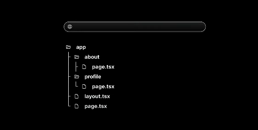
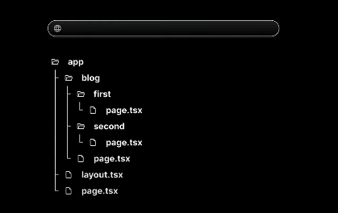
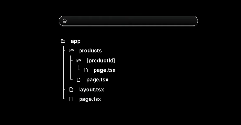

# Routing Concept :-
- Next.js provide us inbuilt routing system. If you have to create different webpages such as :- about,profile,home etc than we have to create a folder name `app` and inside this folder just create the different folder having name home,about,profile etc and the route automatically gets created.

### Example of Simple Routing :-
- Creating routes :-
- Result to Achieve :-

- Folder Structure :-

---

### Example of Nested Routing :-
- If we have to create routes like :- http://localhost:3000/blog/blogone , http://localhost:3000/blog/blogtwo etc so for that here is how we have to create the files:-
- Result to Achieve :-

- Folder Structure :-

---

### Example of Dynamic Routing :-
- If we have to create a Dynamic Route something like this as shown in image below than the folder structure we have to make looks like this:-

- Result to Achieve :-

- Folder Structure :-

---
