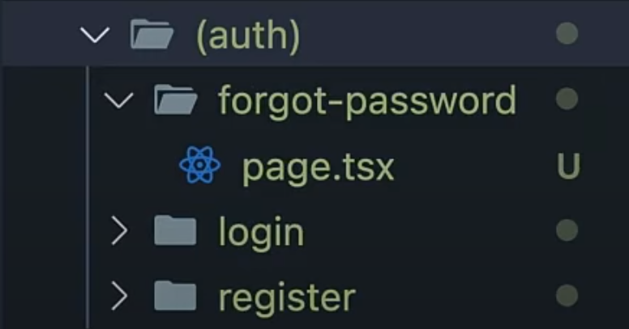

# Routing Concept :-
### This .md file contains following topics :-
1. Routing
2. Nested Routing
3. Dynamic Routing
4. NestedDynamic Routing
5. Catch-all Segments Routing
6. Route Groups

- Next.js provide us inbuilt routing system. If you have to create different webpages such as :- about,profile,home etc than we have to create a folder name `app` and inside this folder just create the different folder having name home,about,profile etc and the route automatically gets created.

### 1. Example of Simple Routing :-
- Creating routes :-
- Result to Achieve :-

- Folder Structure :-

---

### 2. Example of Nested Routing :-
- If we have to create routes like :- http://localhost:3000/blog/blogone , http://localhost:3000/blog/blogtwo etc so for that here is how we have to create the files:-
- Result to Achieve :-

- Folder Structure :-

---

### 3. Example of Dynamic Routing :-
- If we have to create a Dynamic Route something like this as shown in image below than the folder structure we have to make looks like this:-

- Result to Achieve :-

- Folder Structure :-

---

### 4. Example of NestedDynamic Routing :-
- If we have to create a NestedDynamic Route something like this as shown in image below than the folder structure we have to make looks like this:-

- Result to Achieve :-

- Folder Structure :-

---

### 5. Example of Catch-all Segments Routing :-
- If we have to create a NestedDynamic Route something like this as shown in image below than the folder structure we have to make looks like this:-
- Note: we have used square brackets i.e `[]` and create the folder using spread operators `...name`.

- Result to Achieve :-

- Folder Structure :-

---

### 6. Route Groups :-
- Next js Provide us a feature where we can arrange the folders without impacting the URL Structure so that while working on a big projects, we can find the folders easily , One of the example is that :-
- We are creating an authentication Route which contains :- Login Route, Register Route, Forget Password Route.
- For this we have to create these 3 Folder and if we have multiple folders than our app file will get messed.
- To prevent this Next allow us to create some folders (having predefined names) in which we can store these folders.
- Lets take the example of authentication Route :-
- We have to create a folder with name auth within round brackets,syntax looks like :- (auth) , and move all the folders inside it.
- We will get the following Structure for Folders:-

---
